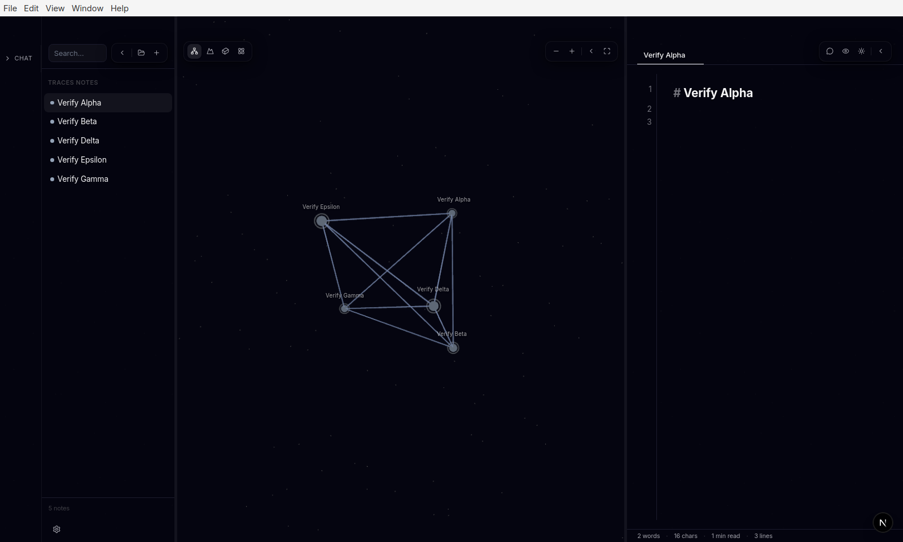
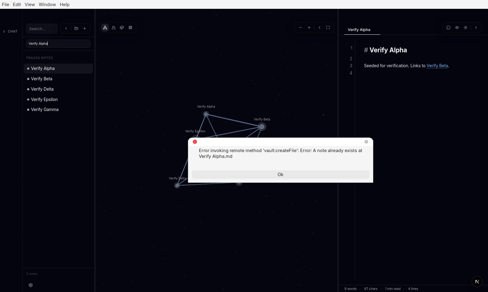
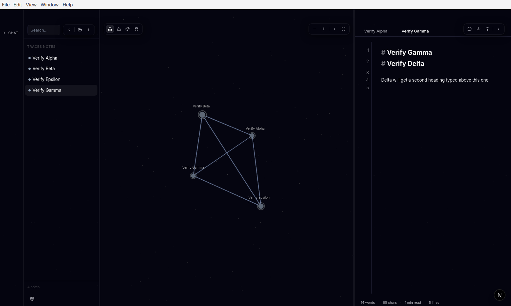
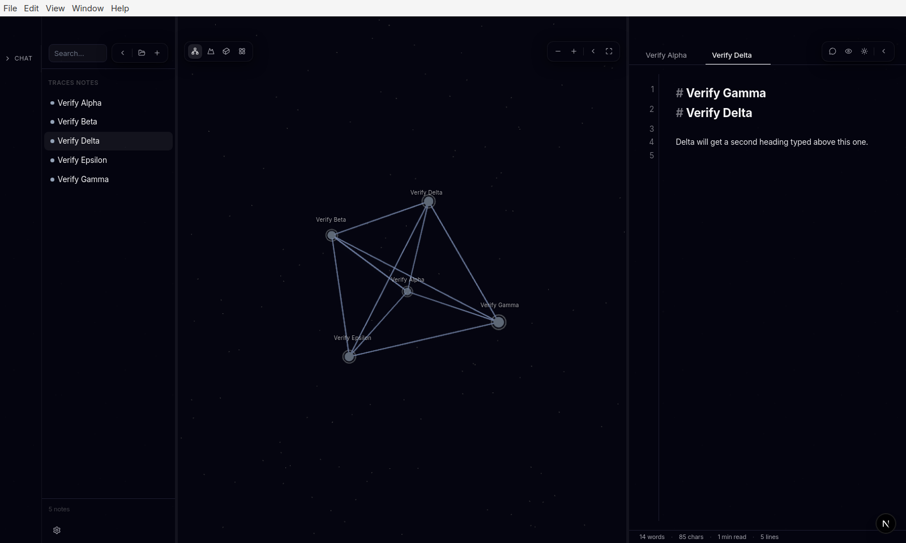
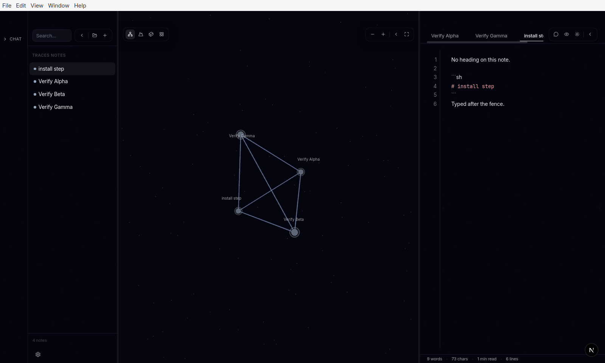
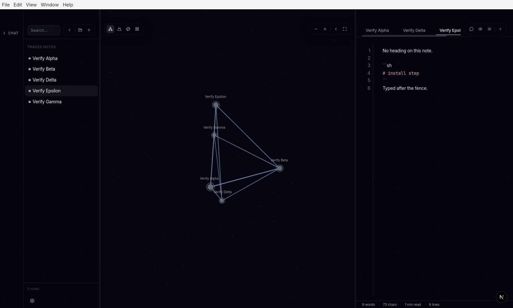

# PR #26 Before / After — Keep notes from being overwritten or dropped

Before = `main` at `9fa115d` (pre-merge). After = `main` at `3b2b22a` (PR #26 squash-merged).
Both runs drove the real Electron window through `.cursor/skills/verify-traces` in an isolated
vault seeded with `Verify Alpha` and `Verify Beta`, plus `Verify Gamma`, `Verify Delta`, and
`Verify Epsilon` for scenarios 2 and 3. Same window geometry (1600×960) for every pair.

## 1. File tree — New Note with a name that already exists

Action: Files header **New Note**, type `Verify Alpha`, press Enter.

| Before | After |
| --- | --- |
|  |  |
| `Verify Alpha.md` is replaced by a bare `# Verify Alpha` heading; the wiki-link paragraph is gone. | An alert says a note already exists at `Verify Alpha.md`; the note keeps its text and the name field stays open to fix the name. |

## 2. Note rename — heading changed to another note's name

Action: open `Verify Delta`, type `# Verify Gamma` as a new first line, wait for the title rename.

| Before | After |
| --- | --- |
|  |  |
| `Verify Delta.md` is renamed over `Verify Gamma.md`. Gamma's text is lost, the tree drops to 4 notes, and the tab now reads "Verify Gamma". | The rename is skipped. Both files exist (5 notes), Gamma's text is untouched, and the tab stays "Verify Delta". |

## 3. Editor — a `# heading` inside a code fence

Action: open `Verify Epsilon` (no real heading, a ```` ```sh ```` block containing `# install step`), type one line at the end.

| Before | After |
| --- | --- |
|  |  |
| The file is renamed to `install step.md`. | The file stays `Verify Epsilon.md`. |
